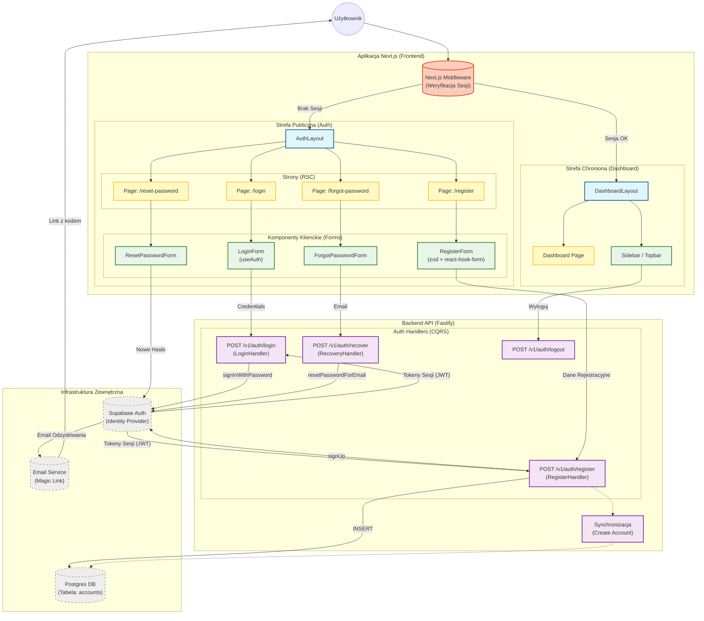

<architecture_analysis>
1. **Komponenty zidentyfikowane w specyfikacji (.ai/auth-spec.md):**
   - **Layouty:** `AuthLayout` (publiczny), `DashboardLayout` (chroniony).
   - **Strony (Server Components):** `LoginPage`, `RegisterPage`, `ForgotPasswordPage`, `ResetPasswordPage`.
   - **Formularze (Client Components):** `LoginForm`, `RegisterForm`, `ForgotPasswordForm`, `ResetPasswordForm`.
   - **Ochrona:** `Next.js Middleware` (weryfikacja sesji Supabase).
   - **Backend API:** `RegisterHandler`, `LoginHandler`, `LogoutHandler`, `RecoveryHandler` (proponowany).
   - **Baza danych/Auth:** `Supabase Auth` (tabela `auth.users`), `Postgres` (tabela `accounts`).

2. **Główne strony i komponenty:**
   - `/login` -> `LoginPage` -> `LoginForm`
   - `/register` -> `RegisterPage` -> `RegisterForm`
   - `/dashboard/*` -> `DashboardLayout` -> `DashboardPage`
   - `/auth/reset-password` -> `ResetPasswordPage` -> `ResetPasswordForm`

3. **Przepływ danych:**
   - Użytkownik wchodzi na stronę -> Middleware weryfikuje tokeny.
   - Formularze (Client) wysyłają żądania do API (Fastify).
   - API (CQRS) komunikuje się z Supabase Auth (Sign In/Up) i Bazą Danych (tworzenie konta).
   - Supabase zwraca tokeny sesji, które API przekazuje do Frontendu.

4. **Opis funkcjonalności:**
   - **AuthLayout:** Minimalistyczny kontener dla stron logowania/rejestracji.
   - **DashboardLayout:** Główny interfejs aplikacji z nawigacją, dostępny tylko dla zalogowanych.
   - **Middleware:** Strażnik routingu, sprawdza obecność i ważność ciasteczek sesyjnych.
   - **API Auth:** Warstwa pośrednia (BFF) zapewniająca spójność między tożsamością (Supabase) a danymi biznesowymi (tabela accounts).
</architecture_analysis>

